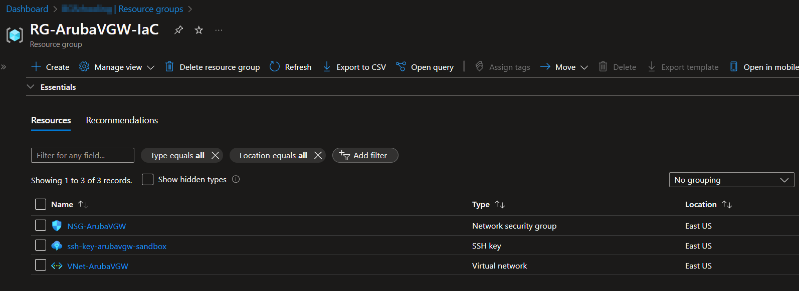

# Lab - Aruba Virtual Gateway Sandbox 1

## Introduction

To deploy the bare minimal requirements in Azure for an Aruba VGW using Azure CLI and Aruba Central Virtual Gateway Platform. Code contains Resource Group, Virtual Network, Subnet, Network Security Group, and SSH Key pair.

Resource View



### Deploy IaC

The lab is also available in the above .azcli that you can rename as .sh (shell script) and execute. You can open [Azure Cloud Shell (Bash)](https://shell.azure.com) and run the following commands build the entire lab:

```bash
wget -O ArubaVGW-Orchestrate-Sandbox.sh https://raw.githubusercontent.com/CyberOps-Ninja/Azure-IaC/main/Project-Azure-CLI/ArubaVGW-Sandbox-1/ArubaVGW-Orchestrate-Sandbox.azcli
chmod +xr ArubaVGW-Orchestrate-Sandbox.sh
./ArubaVGW-Orchestrate-Sandbox.sh
```

### Default Parameters

```bash
# Parameters (Can be changed and should be changed to prevent any overlay in your environment)
rg="RG-ArubaVGW-IaC"
location="eastus"
vnetname="VNet-ArubaVGW-IaC"
address_prefix="10.181.0.0/16"
subnetname="Azure-Services-Subnet"
subnet_prefix="10.181.1.0/24"
nsgname="NSG-ArubaVGW-IaC"
sshkeyname="ssh-key-arubavgw-iac"
```

### Clean-up

```bash
# Parameters 
rg=RG-ArubaVGW-IaC

# Clean up
az group delete -g $rg --no-wait 
```

#### Credit

These labs were inspired by [dmauser](https://github.com/dmauser). Code is not directly copied, but does resemble the sequence of deployment.
