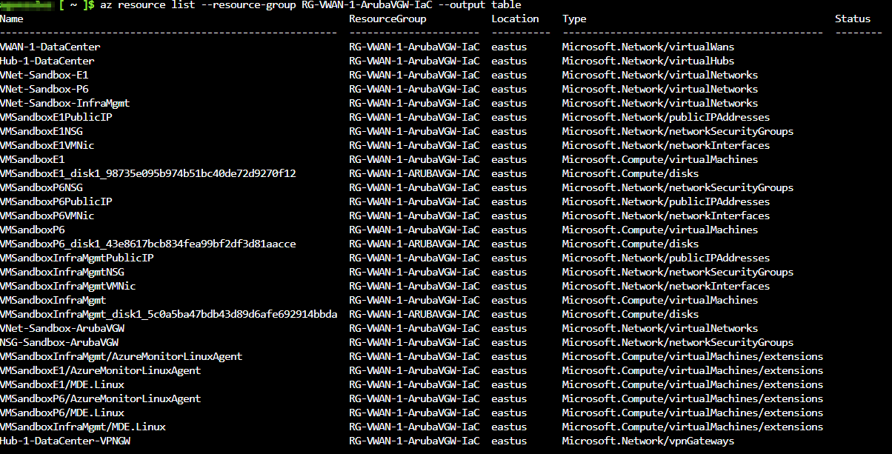

# Lab - Aruba Virtual Gateway Sandbox 2

## Introduction

To deploy the bare minimal requirements in Azure for an Aruba VGW using Azure CLI and Aruba Central Virtual Gateway Platform. Code contains Resource Group, Virtual Network, Subnet, Network Security Group, and SSH Key pair. The second part of this lab is to take it to the next level. By the following: deploying a single Virtual WAN, with a secure hub (Azure Firewall and Policy), VPN Gateway, three spoke vNets, and three Linux virtual machines are scripted in AzureCLI.



### Deploy IaC

The lab is also available in the above .azcli that you can rename as .sh (shell script) and execute. You can open [Azure Cloud Shell (Bash)](https://shell.azure.com) and run the following commands build the entire lab:

```bash
wget -O Single-VWAN-ArubaVGW-Orchestrate-Sandbox.sh https://raw.githubusercontent.com/CyberOps-Ninja/Azure-IaC/main/Project-Azure-CLI/ArubaVGW-Sandbox-2/Single-VWAN-ArubaVGW-Orchestrate-Sandbox.azcli
chmod +xr Single-VWAN-ArubaVGW-Orchestrate-Sandbox.sh
./Single-VWAN-ArubaVGW-Orchestrate-Sandbox.sh
```

### Default Parameters

```bash
# Parameters (Can be changed and should be changed to prevent any overlay in your environment)
rg="RG-VWAN-1-ArubaVGW-IaC"
location="eastus"
# parameters and variables for vwan, hub, and firewall
vwan1name="VWAN-1-DataCenter"
hub1name="Hub-1-DataCenter"
address_prefix_hub1="10.175.0.0/24"
firewallsku="Premium"
# parameters/variables for spoke vnet 1
vnetspokename1="VNet-Sandbox-E1"
address_prefix_sp_vnet1="10.175.1.0/24"
subnetname1="Subnet-Sandbox-E1-Main"
subnet_prefix_1="10.175.1.0/25"
# parameters/variables for spoke vnet 2
vnetspokename2="VNet-Sandbox-P6"
address_prefix_sp_vnet2="10.175.2.0/24"
subnetname2="Subnet-Sandbox-P6-Main"
subnet_prefix_2="10.175.2.0/25"
# parameters/variables for spoke vnet 3
vnetspokename3="VNet-Sandbox-InfraMgmt"
address_prefix_sp_vnet3="10.175.3.0/24"
subnetname3="Subnet-Sandbox-InfraMgmt-Main"
subnet_prefix_3="10.175.3.0/25"
# parameters/variables for Aruba VGW's pre-requisites
vnetnamevgw="VNet-Sandbox-ArubaVGW"
address_prefix_vgw="10.181.0.0/16"
subnetnamevgw="Azure-Services-Subnet"
subnet_prefix_vgw="10.181.1.0/24"
nsgnamevgw="NSG-Sandbox-ArubaVGW"
sshkeynamevgw="ssh-key-arubavgw-sandbox"
# parameters/variables for linux machine
username="azurelinuxadmin"
password="Az-Linux@R00t"
vmsize=Standard_DS1_v2
vmname1="VMSandboxE1"
vmname2="VMSandboxP6"
vmname3="VMSandboxInfraMgmt"
```

### Clean-up

```bash
# Parameters 
rg=RG-VWAN-1-ArubaVGW-IaC

# Clean up
az group delete -g $rg --no-wait 
```

#### Credit

These labs were inspired by [dmauser](https://github.com/dmauser). Code is not directly copied, but does resemble the sequence of deployment.
